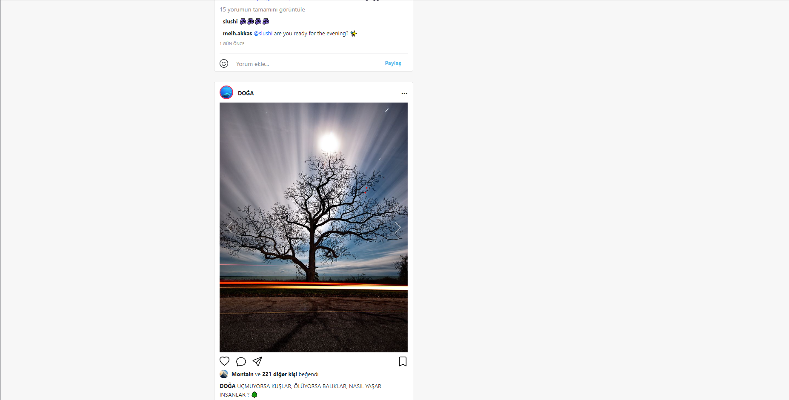

Açıklama ve detaylar için aşağı bakınız.

Sitenin görüntüsü bu şekilde :
-

 # Açıklama :
 Öncelikle herkese merhaba bu proje ve ödevin hepsinde olduğu gibi bu kısmında da faydası ve öğreticiliği yüksek oldu. Geçen sefer Google felaketimden(örnek alacak arkadaşlara almamaları tavsiyesini verdim) sonra bu çok iyi ve örnek alınası bir proje oldu. Kendi adıma buraya devamlı olarak döneceğimi ve örnek alıp sonraki projelerimde de faydalanacağımı biliyorum. Bu sefer gönül rahatlığıyla ilceleyip bakabilirsiniz. Tabi ki eğer yanlış bişey görürseniz iletişime geçip bilgilendirebilirsiniz. Sizden ricam projeyi ve orjinal sayfayı açıp karşılaştırmanız elimden geldiğince aynısını yapmaya çalıştım. 

 Artıları;
- Yüksek oranda benzerlik.
- Paylaşımlarda çeşitliliğe özen gösterildi.(Gönderilerde elimden geldiği kadar çeşit yaptım; 
1) Yorumlar
2) Kaydırmalı resimler
3) Videolar)
- Dropdown eklenip içerisi dolduruldu.
- Simetri.

Eksileri;
- Sağ tarafta kalan kısmı sticky olarak ayarlanamadı.
- Ara çubuğunun içerisine search ikonu yerleştirilemedi.
- Fotoğraflar kutunun içerisini tam doldurmadı.

[Patika](https://app.patika.dev/kajinski)
 